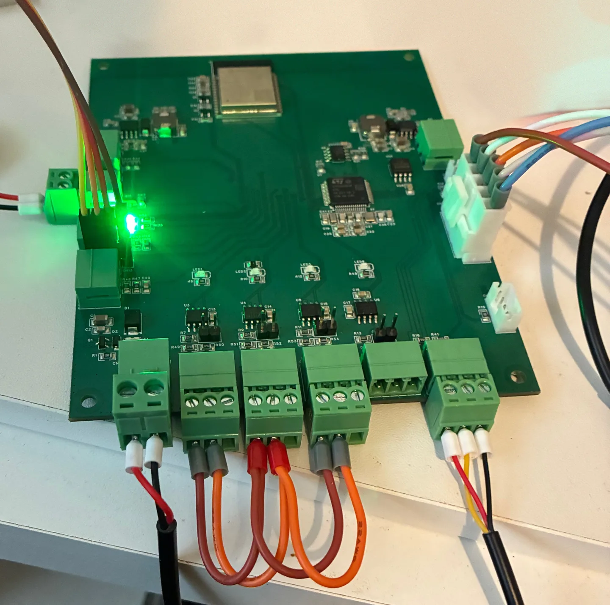

The first revision of the Controller's main board, board A, has been on our bench since 14 September. One board from the first order runs a self-test image that exercises each circuit on a schedule and keeps the results in the board's own memory. Every result below comes from that one board on the bench, before any site installation.

The session logs have the wiring, firmware builds and raw readings: [14 September](https://github.com/origin89hq/hardware/blob/main/boards/controller-a/bench/2026-09-14.md), [15 to 16 September](https://github.com/origin89hq/hardware/blob/main/boards/controller-a/bench/2026-09-16.md) and [16 to 17 September](https://github.com/origin89hq/hardware/blob/main/boards/controller-a/bench/2026-09-17.md).

## Two nights without a laptop

On the first night the board ran for 12 h 50 min from a 12 V battery with the debug probe unplugged. The next morning its own record showed zero failures on every test: 46 260 CAN loopback checks, 22 902 RS-485 exchanges between its own channels and 4 290 rounds of three temperature probes.

On the second night it ran for 16 h 48 min from a bench supply at 14.4 V and polled an 8-channel Modbus RTU I/O module once a second. Of 58 169 polls, one failed at 02:48 with a reply that did not parse; we don't know why yet. The board also switched a 12 V lamp through the module's output about 1 950 times and read the output back each time. The lamp followed every switch, and the board did not reset during the night.

## What works so far

| Circuit | Result | Conditions |
| --- | --- | --- |
| RS-485 | All three channels exchanged frames in all six directions with none missed | Channels wired together on the bench, 115200 8N1 and 9600 8N2 |
| Modbus RTU | A DC meter answered 119 of 120 polls; the I/O module gave a valid reply to all but one of 58 169 | Short bench leads, 9600 baud |
| 12 V input | Reads 1.1 % below the bench supply and an in-line meter | At 13.09 V and 14.39 V, with 1 % divider resistors |
| Temperature | Three DS18B20 probes found and read on the 1‑Wire bus | Readings of 23 to 26 °C on the bench |
| Clock | The two crystals agree to within 13 to 16 ppm; the calendar kept time through a 10 s power loss on its coin cell | Drift over 12 h 50 min; one 10 s power loss |
| Watchdog | A deliberately starved watchdog reset the processor, and the next boot recorded why | Self-test image |
| Wi-Fi | Joined a WPA2 network, got replies to 10 of 10 pings to 1.1.1.1 and downloaded 1 MB at 2.2 Mbit/s | 2.4 GHz at −36 dBm; untuned network buffers probably limit the speed |
| Bluetooth | A 15 s scan found 30 to 43 devices | Receive only |
| CAN | 3 019 frames in loopback with none missed | Loopback does not exercise the transceiver's receiver |

## Not tested yet

- Board B's generator interlock. The [board B log](https://github.com/origin89hq/hardware/blob/main/boards/generator-b/bench/2026-09-14.md) has the details.
- RS-485 on a long cable, and radio range.
- The selector switch, and VE.Direct with a real device.
- Brown-out behaviour, and how far down a battery the board keeps running.

We track problems found on the bench in the [hardware repository's issues](https://github.com/origin89hq/hardware/issues). Follow along with the [Atom feed](/blog/feed.xml).
